# Posts & Comments Manager

App full-stack de posts y comentarios con Angular 20, NestJS y MongoDB.

## Stack

Angular 20 · NestJS · MongoDB · Docker · Tailwind CSS

## Requisitos previos

- **Node 24** el que usan los contenedores; sirve cualquier Node 20+
- **Docker** + Docker Compose.
- **Angular CLI** opcional: el frontend se levanta con `npm`.

> El frontend no necesita `.env`: la URL del backend esta como constante en `frontend/src/app/core/utils/api.constants.ts`.

## Como correr el proyecto

El orden de arranque es **1) MongoDB → 2) backend → 3) frontend**. El frontend
necesita el backend corriendo, y el backend necesita MongoDB.

Hay dos formas de levantar el backend, Docker o local. No se pueden usar las dos a
la vez: ambas ocupan el puerto `3000`.

### Backend

#### Modo A — Desarrollo local

Mongo en Docker, backend con npm:

```bash
# 1. levantar solo MongoDB
docker compose up -d mongodb

# 2. Backend con npm
cd backend
cp .env.example .env
npm install
npm run start:dev
```

Aquí el backend usa el `MONGODB_URI` del `.env` (con `localhost`).

#### Modo B — Docker completo

Mongo + backend juntos en contenedores de docker:

```bash
# desde la raiz
docker compose up --build
```

El backend se conecta a Mongo por el nombre de servicio (`mongodb`), el compose inyecta `MONGODB_URI=mongodb://mongodb:27017/posts_comments_db`, que sobrescribe el del `.env` solo dentro de Docker.

### 3 · Frontend

```bash
cd frontend
npm install
npm start
```

Abre `http://localhost:4200`.

## Cargar datos de ejemplo

La app abre vacía hasta que haya posts. Con el **backend ya corriendo**, puebla la base con el archivo de ejemplo `docs/example-posts.json` (un array de posts) vía
`POST http://localhost:3000/posts/bulk`. usar Postman, Insomnia, Thunder Client o curl:

```bash
curl -X POST http://localhost:3000/posts/bulk \
  -H "Content-Type: application/json" \
  -d @docs/example-posts.json
```

Recarga el frontend y verás los posts cargados.

## Capturas y video

Video demostrativo del funcionamiento: https://youtu.be/I06DCzauZTY

### Listado de posts
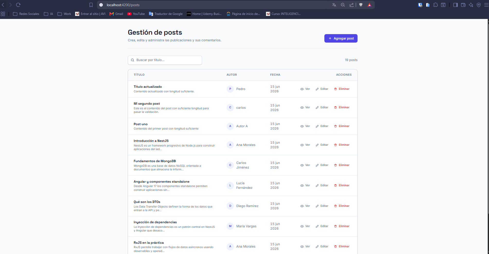

### Búsqueda de posts
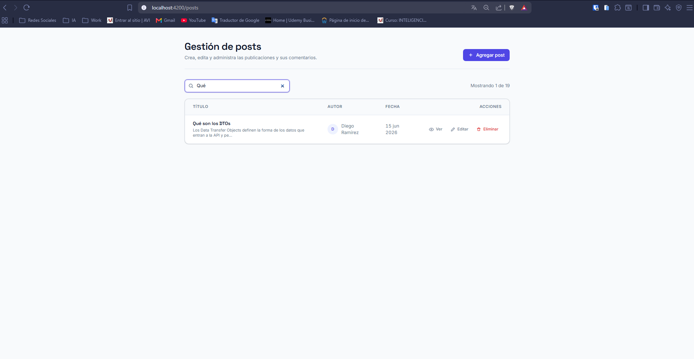

### Agregar un post
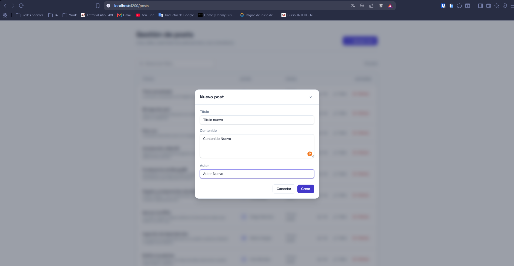

### Editar un post
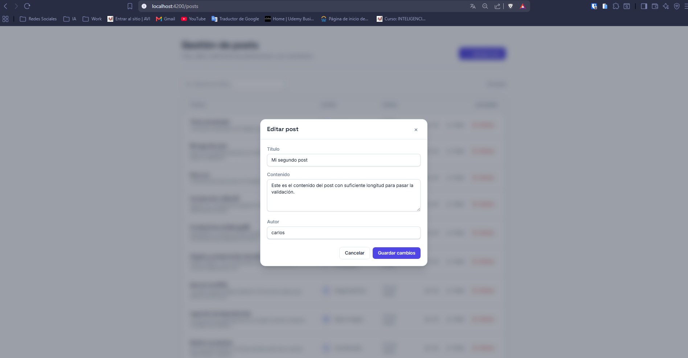

### Eliminar un post
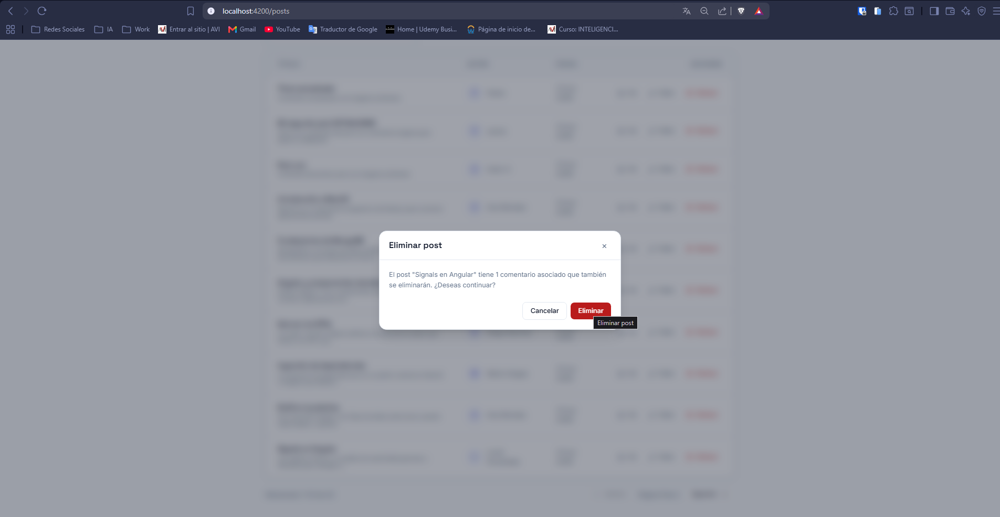

### Detalle del post y agregar comentarios
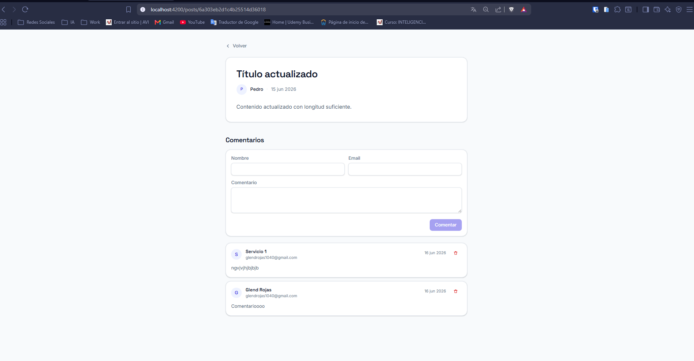

### Agregar un comentario
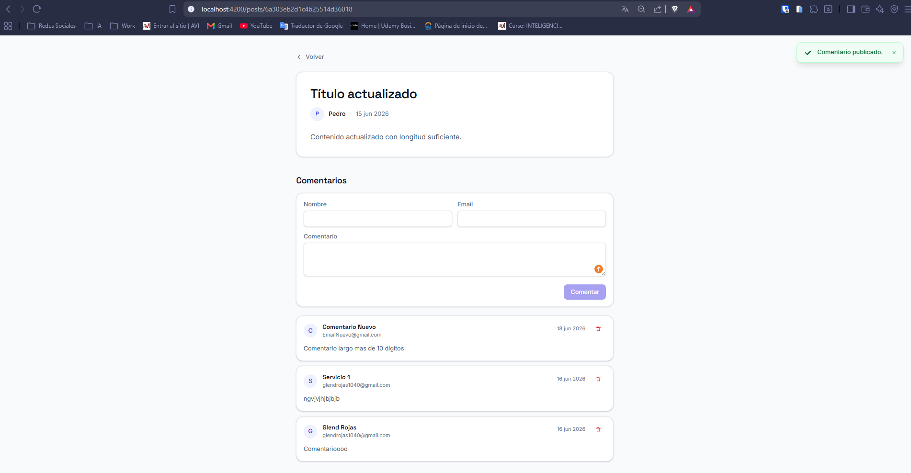

### Eliminar un comentario
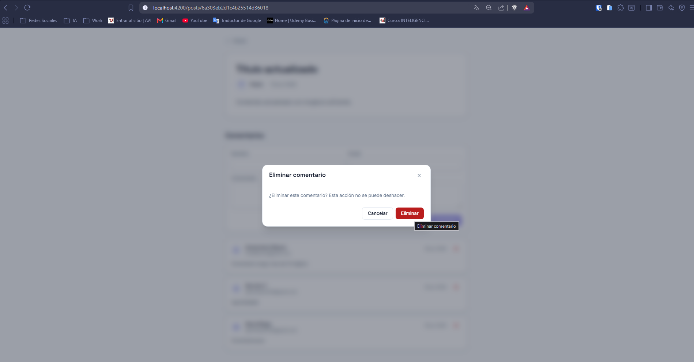

### Alertas y notificaciones
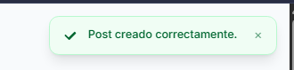
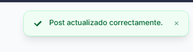
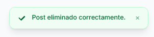
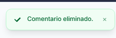

## Entregables / Recursos

- **Datos de ejemplo (carga masiva):** `docs/example-posts.json`.
- **Colección de Postman:** `docs/post-comments-manager-ENDPOINTS.postman_collection.json`.

Importa la colección de Postman para probar todos los endpoints de la API.

## Puertos

| Servicio | Puerto |
|----------|--------|
| Backend  | 3000   |
| Frontend | 4200   |
| MongoDB  | 27017  |